# Background

1. The memory today is **tightly coupled** to CPU. 

- Memory is homogeneous, which mean they have the same type, latency, capacity and bandwidth etc.
- The rack-level memory power and cost increases with new hardware generations as shown in Figure 1.

<figure>
       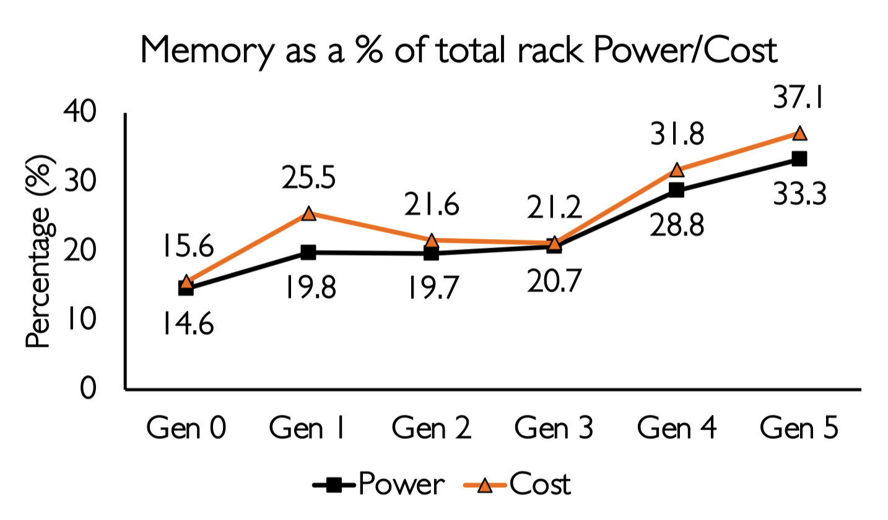
       <figcaption>Figure 1: Trends in rack-level memory power and cose increases with new hardware generations over time.</figcaption>
   </figure>

2. CXL-based Heterogeneous Memory
The category of CXL memory can be categorized as shown in Figure 2.

<figure>
       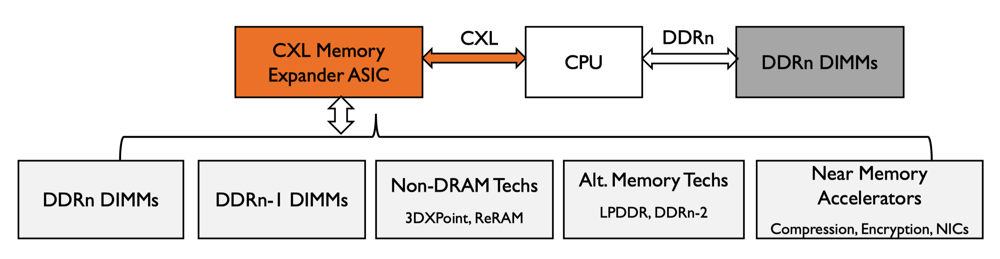
       <figcaption>Figure 2: CXL memory abstraction and categories.</figcaption>
   </figure>

- The CXL memory have several strengths in flexible CPU and memory bus, which includes:
    - different memory capacity to bandwidth ratio
    - combine different generation of DIMMs
    - use cheaper and low power memory alternatives
    - utilize near memory accelerators

3. CXL-Memory Characteristics
- Byte addressable in same physical address space
    - transparent allocation with cache-line granular access

- Memory bandwidth is like DDR channels
    - NUMA BW is better than a dual socket system

- Close to NUMA latency on dual socket systems
    - adds ~100ns latency over normal DRAM access

<figure>
       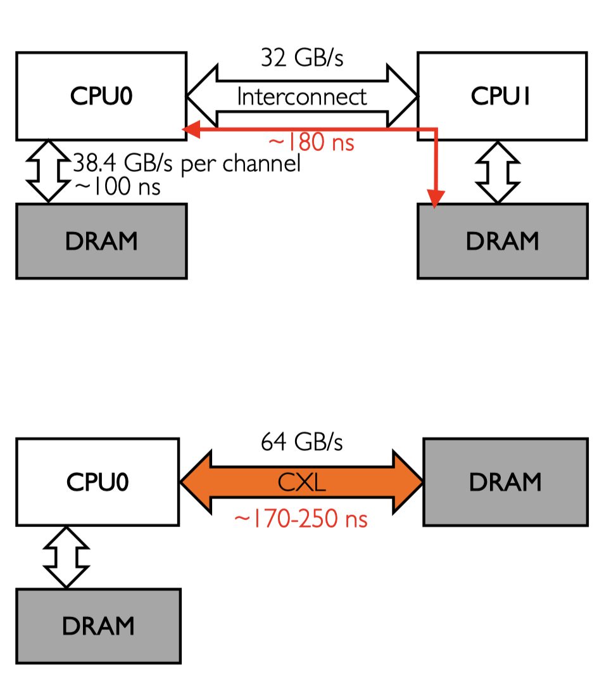
       <figcaption>Figure 3: CXL memory lantency and bandwidth.</figcaption>
   </figure>

4. Performance drops with large CXL-Memory as shown in Figure 4
<figure>
       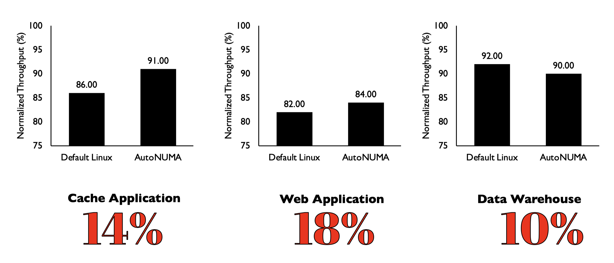
       <figcaption>Figure 4: CXL memory performance degration.</figcaption>
   </figure>

Consider about the aforementioned background/drawback, this paper present a work named TPP (Transparent Management of Tiered-Memory) which include the following main parts:

1. Effective memory management for tiered-memory system
    - lightweight demotion to slow memory tier
    - efficient hot page promotion to fast memory tier
    - optimized page allocation path to reduce latency
    - workload aware page allocation policy

2. Without modifying any applications or hardware

# Characterizing Datacenter Applications

1. Page Temperature
    - **Observation:** A significant portion of a datacenter application's accessed memory remain cold for minutes as shown in Figure 5. Tiered memory system can be a good fit for such cold memory if page placement mechanism can move these code pages to a lower memory tier.
<figure>
       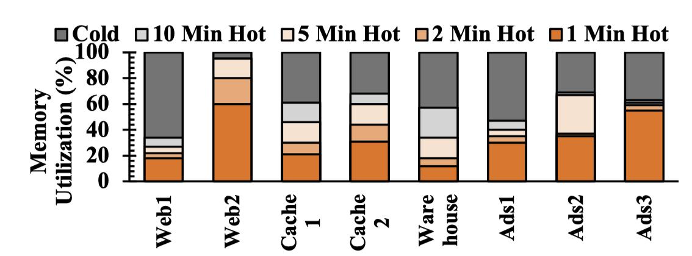
       <figcaption>Figure 5: Application memory usage over last N mins.</figcaption>
   </figure>

2. Temperature Across Different Page Types
    - **Observation:** A large fraction of anon (anonymous) pages is hot, while file pages are comparatively colder within short intervals as shown in Figure 6.
    <figure>
       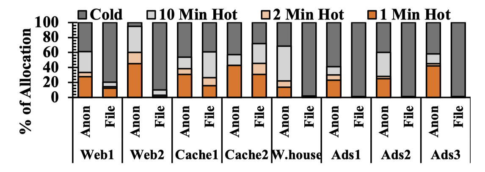
       <figcaption>Figure 6: Application memory usage over last N mins.</figcaption>
   </figure>

3. Usage of Different Page Types Over TIme
    - **Observation:** Although anon and file usage may vary over time, applications mostly maintain a steady usage pattern as shown in Figure 7. Smart page placement mechanisms should be aware of page type when making placement decision.
    <figure>
       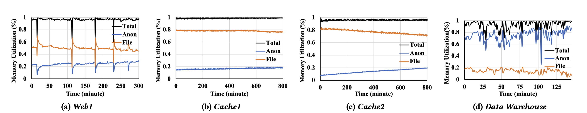
       <figcaption>Figure 7: Memory usage over time for different applicaitons.</figcaption>
   </figure>

4. Impact of Page Types on Performance
    - **Observation:** Workloads have different levels of sensitivity toward different page types that varie over time as shown in FIgure 8.
    <figure>
       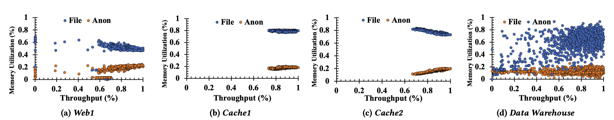
       <figcaption>Figure 8: Workloads’ sensitivity towards anons and files varies. High memory capacity utilization provides high throughput.</figcaption>
   </figure>

5. Page Re-access Time Granularity
    - **Observation:** Cold page re-access time varies for workloads as shown in Figure 9. Page placement on a tiered memory system should be aware of this and actively move hot pages to lower memory nodes to avoid high memory access latency.
    <figure>
       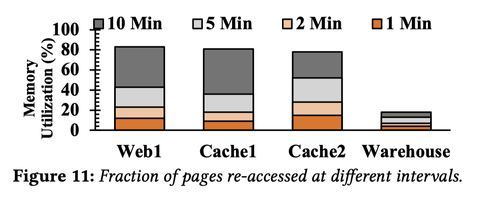
       <figcaption>Figure 9: Fraction of pages re-accessed at different intervals.</figcaption>
   </figure>

# TPP for CXL-Memory

Based on the above observations, this paper introduced TPP - a smart OS-managed mechanism for tiered-memory system. TPP's design-space can be divided across four main areas:

>    1. Lightweight demotion to CXL-Memory
>    2. Decoupled allocation and reclamation paths
>    3. Hot-page promotion to local nodes
>    4. Page type-aware memory allocation

## Migration for Lightweight Reclamation

### Page Placement in ==*Default Linux*==
Every node maintains a water mark to determine load (Figure 10):
- relcamation triggers when number of free pages goes below the watermark
- new pages get allocated to remote node
- reclamation stops when free pages goes above the watermark
- new allocations again happen on local node

 <figure>
       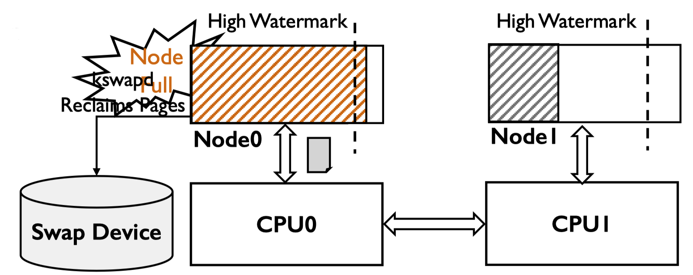
       <figcaption>Figure 10: Traditional page placement in linux.</figcaption>
   </figure>

### Demotion in TPP - ==Migrate to slow Tiers==
Compare to traditional page reclamation, TPP will do the different. After finding the reclamation-candidates, instead of invoking swapping mechanism, TPP put them in to a separate demotion list and try to migrate them to the CXL-node asynchronously. Migration to a NUMA node is orders of magnitude faster than swapping. TPP use Linux's default LRU-based mechanism to selece demotion candidates.

Maintains a separate demotion page list
- scans inactive page list
- if not enough, then scan active pages (memory pressure may be very big)

Tries to migrate scanned pages to slow memory tier
- failed pages follows default reclamation path

Demotion on CXL-Memory use the default reclamation mechanism (e.g,. pages out to the swap device) since the pages on CXL-Memory is not very performance critical. As shown in Figure 11.

 <figure>
       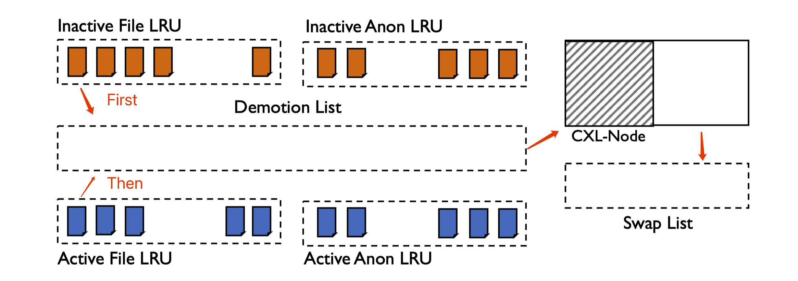
       <figcaption>Figure 11: Demotion in TPP.</figcaption>
   </figure>

## Optimized Allocation Path in TPP
Decouples page allocation and reclamation logic, as shown in Figure 12
- reclamation triggers when x% memory is left
- allocation happens on local node as long as allocation watermark is satisfied

User-space interface to control reclamation watermark
- *vm.demote_scale_factor* (by default,set to 2% of local node's capacity)
<figure>
       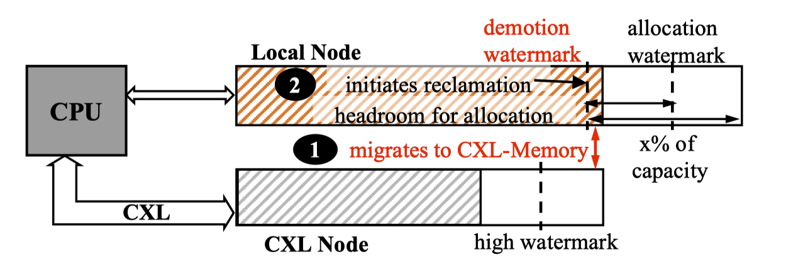
       <figcaption>Figure 12: TPP decouple the allocation and reclamation logice for local memory node. It uses migration for demotion.</figcaption>
   </figure>

## Page Promotion from CXL-Node

### NUMA Balancing for CXL memory
When a CPU access a sampled page, a minor page-fault is generated (known as NUMA hint fault). Pages that are accessed from a remote CPU are migrated to that CPU's local memory node (known as promotion). TPP limits sampling only to CXL-nodes since it's not resonable to promote a local node's hot memory to other local or CXL-nodes.

### Issue: Ping-Pong due to Opportunistic Promotion.

When A NUMA hint fault happens on a page, NUMA balancing will instantly promotes the page w/o checking its active state. Those pages may have very infrequent accesses can still be promoted to the local node. And those pages may become the demotion candidate shortly if the local nodes are always under pressure causing Ping-Pong issue.

### Apt Idenfication of Trapped Hot Pages.

To solve the Ping-Pong issue, instead of instan promotion. **TPP check a page's age through its position in the LRU list maintained by the OS**. If the faulted page is in inactive LRU, TPP doesn't consider the page for promotion instantly as it might be an infrequently accessed page. TPP considers the **faulted page as a promotion candidate only if it is found in the active LRUs** (① in Figure 13). The whold process is shown in Figure 13.

<figure>
       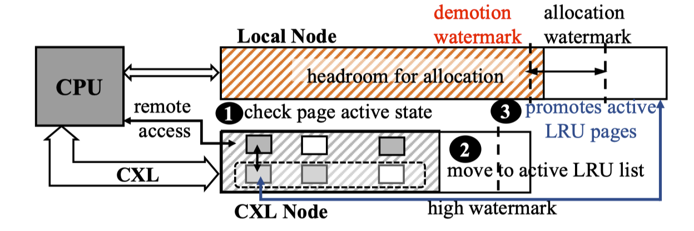
       <figcaption>Figure 13: TPP promotes a page considering its activity state.</figcaption>
   </figure>

> Issue: if a memory node is not under pressure and reclamation doesn't happen, then pages in inactive LRU list do not automatically move to the acvite LRU list. As CXL-nodes may not always be under pressure, faulted pages may often be found in the inactive LRU list and, therefore, bypass the promotion filter.

To address, when found a faulted page on the inactive LRU list, TPP marks this page as accessed and move it to the acitive LRU list (② in Figure 13). If the page still remains hot during the next NUMA hint fault, it will be in the active LRU, and promoted to the local node (③ in Figure 13).

As aforementioned, only the page in active LRUs lists will be promoted to the local node's memory and if a page is in inactive LRUs, the first NUMA hint fault will promote the page to active LRUs list. The second NUMA hint fault (still hot) will promote this page to the local node memory. As shown in Figure 14.
<figure>
       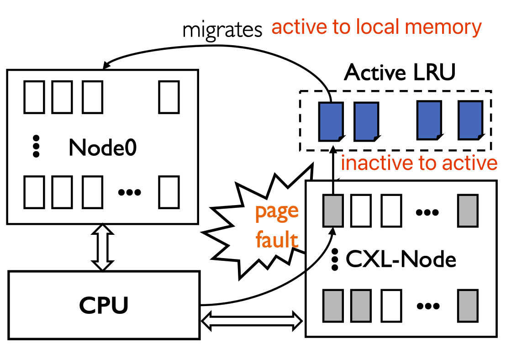
       <figcaption>Figure 14: Process of TPP promotes a page.</figcaption>
   </figure>

### Page Type-Aware Allocation

According to the observation before. **Some applications can furthur benefit from page type-aware allocation policy**. Considering this, TPP allows an application allocating caches (eg., file cache, tmpfs, ect.) to the CXL-nodes preferrably, while preserving the allocation policy for anon pages.

## Acknowledgement
All the figures are from the author's slides or paper.
