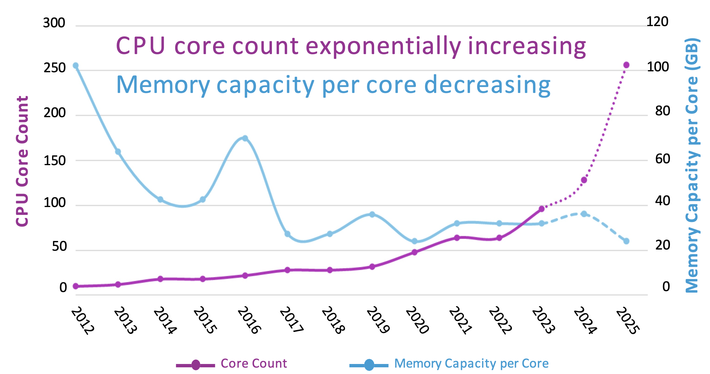
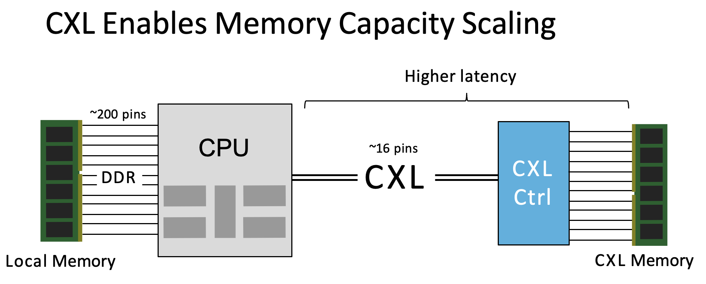

# Background

1. CPU **core counts scaling faster** than memory capacity. As shown in the figure 1

<figure>
       
       <figcaption>Figure 1: Trends in CPU core counts and memory capacity per core over time.</figcaption>
   </figure>

2. CXL enable second-tier memory to facilitate core scaling

<figure>
       
       <figcaption>Figure 1: Trends in CPU core counts and memory capacity per core over time.</figcaption>
   </figure>

3. CXL has higher latency that will hurts peoformance if not mitigated
4. Software tiering helps some but is not well suited for public clouds

# Abstract

Cloud providers use CXL-based memory to increase aggregate memor capacity and reduce cost. However, the main challenge:
1. CXL accesses will have **high lantancy** than local DRAM (2X than the local memory)
2. Existing systems use **software** to manage data to manage data placemanet acress tiers at page granularity (which is too coarse in author's opinion).

In order to resolve the above challanges, the author propose combiniing hardware-managed tiering ([*Intel Flat Memory Mode*](#TBC)) with software-manages performance isolation ([Memstrata](#TBC)). Should note that *Intel Flat Memory Mode* is not proposed by the author.

The *Intel Flat Memory Mode* is the first hardware-managed tiering system which will provide performance close to local memory (regular DRAM) but still have the following drawback:
1. Cannot resolve the memory contention across tenants
2. Cannot resolve intra-tenant contention due to conlicting access patterns.

And Memstrate can resolve the above challenges.

# Introduction

Two tier memory: 
1. Capacity memory Tier: used to augment local accessed DRAM. This tier is more affordable.
2. Performance tier: local memory, faster but will have higher TCO (total cost of ownership).
