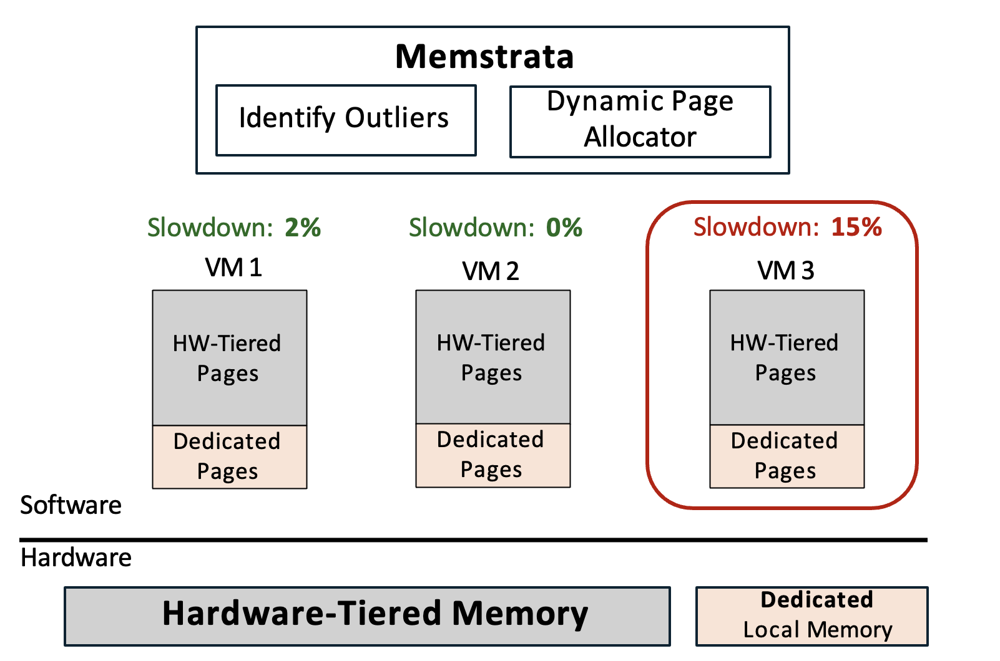

# Background

1. CPU **core counts scaling faster** than memory capacity. As shown in the figure 1

<figure>
       
       <figcaption>Figure 1: Trends in CPU core counts and memory capacity per core over time.</figcaption>
   </figure>

2. CXL enable second-tier memory to facilitate core scaling. As shown in figure 2

<figure>
       
       <figcaption>Figure 2: CXL is able to increase the capacity of memory.</figcaption>
   </figure>

3. CXL has higher latency that will hurts peoformance if not mitigated. To be specific, CXL latency (220 ns) ≈ 2x local memory latency (100 ns)
4. Software tiering helps some but is not well suited for public clouds

# Abstract

Cloud providers use CXL-based memory to increase aggregate memor capacity and reduce cost. However, the main challenge:
1. CXL accesses will have **high lantancy** than local DRAM (2X than the local memory)
2. Existing systems use **software** to manage data to manage data placemanet acress tiers at page granularity (which is too coarse in author's opinion).

In order to resolve the above challanges, the author propose combiniing hardware-managed tiering ([*Intel Flat Memory Mode*](#TBC)) with software-manages performance isolation ([Memstrata](#TBC)). Should note that *Intel Flat Memory Mode* is not proposed by the author.

The *Intel Flat Memory Mode* is the first hardware-managed tiering system which will provide performance close to local memory (regular DRAM) but still have the following drawback:
1. Cannot resolve the memory contention across tenants
2. Cannot resolve intra-tenant contention due to conlicting access patterns.

And Memstrate can resolve the above challenges.

# Introduction

Two tier memory: 
1. Capacity memory Tier: used to augment local accessed DRAM. This tier is more affordable.
2. Performance tier: local memory, faster but will have higher TCO (total cost of ownership).

In this paper, the author focus on the basic use case where a CXl memory device is locally attached and dedicated to a single host. Most of the prior work is *software-managed memory tiering*. The following figure show the difference of prior work and the work of this paper is shown in figure 3.

<figure>
       
       <figcaption>Figure 3: Comparison of prior work and this paper.</figcaption>
   </figure>

## Software-managed memory

### Overview
Software-managed memory mode use hypervisor/OS to identify popular pages and decide page placement. As shown in figure 4.

<figure>
       
       <figcaption>Figure 4: Software-managed memory mode.</figcaption>
   </figure>

### Drawback:

There are two main drawback of software-managed memory
1. High CPU overhead
- Since the software is usually not involved in memory access, software tiering need to rely on some Hardware feature to track memory access in order to decide which page is more popular. One operation is to use instruction sampling  such as PEBS or IBS, however, they are disabled in the cloud due to privacy concern. 
- Another option is to scan page table. However, in order to acquire the accurate information, frequently page table is required which incur high CPU overhead. 

2. Huge page penalty
- Although large page size reduce the TLB cost in virtualized environment, they negatively affect the software tiering. For example, figure 5 shows a page table entry that corresponds to a 2 MB region. According to the author’s experiments. It is likely that this 2MB region has both hot data and cold data. In software tiering, it can only be mapped to the CXL memory or to the Local Memory.

<figure>
       
       <figcaption>Figure 5: Hot and cold data migrate using huge page.</figcaption>
   </figure>

# Intel® Flat Memory Mode

## Overview:

1. First hardware-managed cacheline granular memory tiering for CXL
2. Data placement managed by the CPU memory controller
- Zero CPU overhead
- Huge page friendly
3. Available in intel Xeon 6 Processor

The associativity and mapping of *Intel® Flat Memory Mode* is shown in figure 6.

<figure>
       
       <figcaption>Figure 6: Associativity and mapping of *Intel® Flat Memory Mode*.</figcaption>
   </figure>

Local memory as a direct-mapped, exclusive cache of CXL memory. The exclusive means that The cache line is either cached in local memory or CXL memory but not both. The capacity between local memory and CXL memory should be 1:1 which is N GB in this graph. The total physical memory exposed to the software is then 2N GB. 

Since the local memory is a direct map cache. A given cache line in the physical memory address space. Cacheline A in figure 6 can only be cached in one location in the local memory. As the capacity ratio between local and the physical memory is 1 to 2. there will be another cache line, Cacheline B in figure 6. That is mapped to the same location in local memory as Cacheline A. Only one of them can be placed in local memory in the same time. The other one will be stored in the CXL memory.

## Example of Local Memory miss in Intel® Flat Memory Mode

1. As shown in figure 7(a), the Cacheline A is now stored in the local memory, assume that now we have a main memory access on Cacheline B. For example, an LLC miss on Cacheline B. 
<figure>
       
       <figcaption>Figure 7(a): Memory miss on local memory.</figcaption>
   </figure>

2. The memory controller will read in the local memory to check if Cacheline B is in there. In this case, it will find that this is a miss. As shown in figure 7(b).

<figure>
       
       <figcaption>Figure 7(b): Memory miss on local memory.</figcaption>
   </figure>

3. The memory controller will then read from the CXL memory  to get the data of cache line B. As shown in figure 7(c).

<figure>
       
       <figcaption>Figure 7(c): Memory miss on local memory.</figcaption>
   </figure>

4. After fetching the data of Cacheline B.  The memory controller will server the data to the core that request the Cacheline B. And then, in the same time, it will swap the Cacheline A and B in the local memory and CXL memory so that now Cacheline B is stored in the local memory because it has been accessed most recently. As shown in figure 7(d).

<figure>
       
       <figcaption>Figure 7(d): Memory miss on local memory.</figcaption>
   </figure>

## Drawback of Intel® Flat Memory Mode

1. The first challenge is that although the hardware tiering is trying to place the most frequently accessed data in local memory. Some workloads do have heavy local memory misses and slow down. The author measuring the slowdown of both hardware tiering and software tiering using popular workloads. figure 8 shows the CDF of slowdown compared to only using the local memory. The x-axis is the slowdown and y-axis is the CDF where higher is better. 

<figure>
       
       <figcaption>Figure 8: slowdown vs. Local Memory Only.</figcaption>
   </figure>

The hardware tiering significantly reduced the slowdown compared to the TPP. However, there still 26% of workload which has more than 5% slowdown. The author call the workload which have more than 5% slowdown as the outlier. Those outliers have cache unfriendly memory access pattern, and are sensitive to memory latency.

2.  Assume we have 2 VMs Vm1 and VM2. It is likely that they are mapped to a common local memory range. In this case, they will compete for the local memory depending on which VM is more memory intensive. The author find that this local memory contention across VM can cause more than 50% slowdown. As shown in figure 9.

<figure>
       
       <figcaption>Figure 9: Local memory contention across VMs (more than 50% slowdown).</figcaption>
   </figure>

# Memstrata 

## Dedicated memory
To overcome the drawback of hardware-managed cacheline memory tiering system. One way is to increase the amount of local memory by add dedicated local memory beside the hardware tiered memory. The dedicated local memory  is directly exposed to the host physical address space and the data there always stay in the local memory. As shown in figure 10.
<figure>
       
       <figcaption>Figure 10: Dedicated local memory.</figcaption>
   </figure>

However, one question is that how to allocate dedicated local memory across VMs?

## Memstrata: Memory Allocator for Hardware Tiering
Memstrata is used to allocate dedicated local memory across VMs which has the following features:
1. A lightweight memory allocator in the hypervisor
2. **Dynamically allocates dedicated memory to eliminate outliers**
3. **Provides performance isolation between VMs using page coloring**

Figure 11(a)-11(c) shows how Memstrata allocate dedicated local memory across VMs dynamically. So on the hardware side, hardware tiered memory and dedicated local memory are exposed at two separate range in the host physical address space. Let’s say we have three VM running on the host. Each with a fixed percentage of Hardware tier pages and dedicated pages. Different VM could have different slowdown because they run different workload. 
<figure>
       
       <figcaption>Figure 11(a): Memstrata workflow.</figcaption>
   </figure>

In order to mitigate the performance of the outlier, Memstrate will first identify the outlier VM. And it will be given more dedicated local memory, 

But there are two challenges to identify outliers in hypervisor.
1. Hypervisor is unaware of VM workloads due to privacy concern.
2. Hardware tiering only provides system-wide local memory miss rate. It doesn’t report the miss rate per core or per VMs. This is because the data placement is managed by the CPU memory controller not by individual cores.

So the author build a lightweight prediction model to identify outliers using low-level performance metrics. For example: Per-core metric: L3 miss latency correlates with miss ratio. (Detailes see Section 4.2 in their paper)

After find the outliers, Memstrata will dynamically allocate dedicated pages as shown in figure 11(b). 
<figure>
       
       <figcaption>Figure 11(b): Memstrata workflow.</figcaption>
   </figure>

After that, the outlier VM will not suffer from the slowdown. As shown in figure 11(c).
<figure>
       
       <figcaption>Figure 11(c): Memstrata workflow.</figcaption>
   </figure>
