# PolyStore: Exploiting Combined Capabilities of Heterogeneous Storage

FAST '25, Rutgers University + EPFL + Samsung Semiconductor (Yujie Ren et al., Feb 25-27 2025, Santa Clara)

**In one sentence**: Storage hierarchies waste bandwidth because they always put the fast device *on top*; PolyStore lays heterogeneous storage devices out **horizontally** as a meta-layer above per-device-optimized file systems (NOVA on PM, ext4/F2FS on flash), so a single logical file is striped across all of them at 2 MB granularity. Result: **up to 9.38x** over state-of-the-art caching/tiering on microbenchmarks and **1.52x-2.02x** on real applications.

# Background

1. Storage media stopped being a clean ladder. PM (Optane) is byte-addressable with low latency; NVMe SSDs have high throughput; CXL-based SSDs offer low latency *and* high bandwidth; SATA SSDs give capacity. The paper calls this the **"non-hierarchical" trend** in **HSDs** (heterogeneous storage devices).

2. Prior art all assumes hierarchy, in three flavors:
   - **Caching** (bcache, Orthus, P2CACHE): fast device absorbs writes / accelerates reads, slow device backs it.
   - **Tiering** (Strata, Ziggurat, SPFS): data lives *exclusively* on one tier, migrated by hotness policy.
   - **Application-directed** (NoveLSM, DBMS WAL placement): app-level knowledge decides placement.

3. **Table 1 — what nobody supports before PolyStore.**

| HSD property | Caching | Tiering | App-specific | **PolyStore** |
|---|---|---|---|---|
| Cumulative **read** bandwidth utilization | partial (Orthus only) | ✗ | ✗ | **✓** |
| Cumulative **write** bandwidth utilization | ✗ | ✗ | ✗ | **✓** |
| Heterogeneity-aware DRAM caching | partial (P2CACHE only) | ✗ | ✗ | **✓** |
| Cross-device durability & crash consistency | ✗ | ✓ | ✓ | **✓** |

   The interesting cell is **cumulative write**: *no* prior system gets it. Orthus reaches cumulative *reads*, but only after the fast device is already saturated, and its block-layer implementation cannot guarantee atomicity or durability, so it cannot be extended to writes.

# Motivation: three ways hierarchy loses

1. **Fast-on-top forfeits the combined bandwidth.** Even Orthus, the best non-hierarchical caching design, still performs *writes* hierarchically.
2. **Prioritizing the fast device creates contention on it.** PM in particular degrades past ~8 threads. Eager placement on fast storage also burns bandwidth on eviction and migration.
3. **DRAM caching is static.** The Linux page cache and DRAM+PM designs (P2CACHE, Ziggurat) do not adapt to the varying performance gaps between devices in an HSD set.

<figure>
       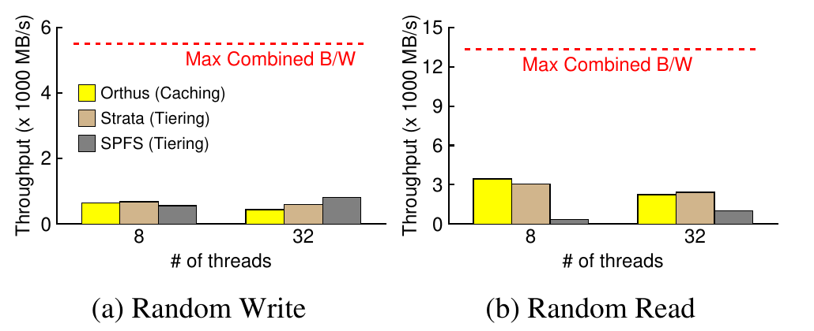
       <figcaption>Figure 1: Inefficient hardware utilization. 32 threads, direct I/O without DRAM cache, each thread on its own 2 GB file (Config I). The red line is the combined PM+NVMe bandwidth — every existing system sits far below it.</figcaption>
   </figure>

The read case is instructive per system: Orthus must *admit* data NVMe -> PM on a miss, so random reads turn into concurrent PM **writes**; Strata has the same problem; SPFS refuses to promote NVMe data until a *write* touches it, so with the page cache off its reads are stuck at NVMe speed.

# Design of PolyStore

<figure>
       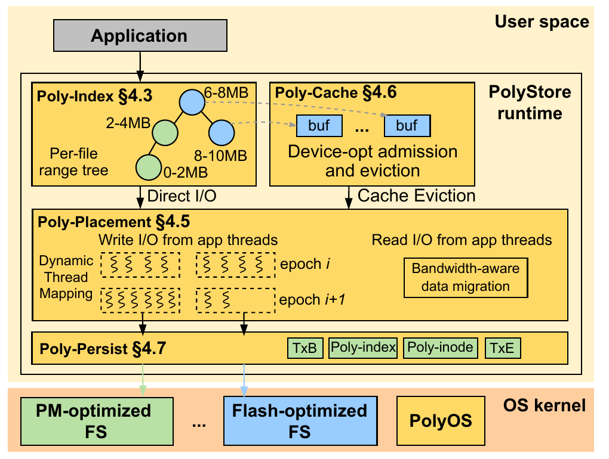
       <figcaption>Figure 2: PolyStore high-level design. A user-level runtime (Poly-index, Poly-cache, Poly-placement, Poly-persist) intercepting POSIX I/O, plus a thin VFS kernel component (PolyOS) for sharing/fairness/security, sitting atop unmodified device-optimized file systems.</figcaption>
   </figure>

**The central architectural bet**: don't write a new multi-device file system — write a *meta layer* and reuse mature, hardware-optimized file systems underneath (NOVA for PM, ext4/F2FS for flash). Split it across user and kernel: the **runtime** maps data across devices, the **OS component** keeps protection, sharing and fairness.

## Structures (§4.3)

- **Poly-inode** — one logical file → N physical files, one per device. Holds per-device fds and refcounts.
- **Poly-index** — a **range-tree** (augmented red-black tree keyed by non-overlapping `(low, high)` intervals). Each node is the unit of locking and covers **2 MB by default**, chosen because (1) it balances memory footprint against concurrency and (2) it matches **Linux's maximum block I/O size for a single request**, so a whole range evicts in one request. Per-node reader-writer lock. **128 B in memory / 96 B on disk**, so a 1 TB file costs only **64 MB (0.0064%)**.
- **Hybrid namespace** — directory hierarchy on the fast device (`/fast/d1/f1`), **flat hashed names** on slow devices (`/slow/hash("polyfs/d1/f1")`), to avoid paying random-access name resolution on the slow tier.

Both Poly-inode and Poly-index live in memory-mapped files on the faster storage.

## Heterogeneity-aware file system ops (§4.4)

- **Adaptive file creation.** Start every file on *one* device. Only when it grows past the 2 MB threshold and bandwidth saturates does PolyStore create additional physical files on other devices. Small files never pay the cost of two file systems.
- **Write indexing** handles three cases: unindexed range (create nodes on demand), partially indexed (I/O the whole range, backfill nodes), fully indexed (in-place update of modified blocks only, to limit write amplification).
- **Static thread→device mapping** as the baseline: offline, using `fio`, determine how many threads saturate each device; fill the fastest device first, spill the rest to slower devices. **A single write's blocks always land on a single device** — that is what makes ordering and crash consistency tractable.
- **POSIX appends** are preserved two ways: all physical files are opened in append mode (serialization within a device), and Poly-index **timestamps** establish global order across devices. The timestamps also constrain eviction: when `blkN` is evicted, all of `blk0..blkN-1` must be too. On failure, recovery truncates everything after the first unrecoverable block.

## Poly-placement: dynamic thread remapping (§4.5.1)

Finding the optimal thread→device mapping is knapsack-hard, so PolyStore uses a **greedy three-state machine** per adjacent device pair, re-evaluated every **200 ms epoch**, with a configurable **50%** bandwidth-change threshold:

<figure>
       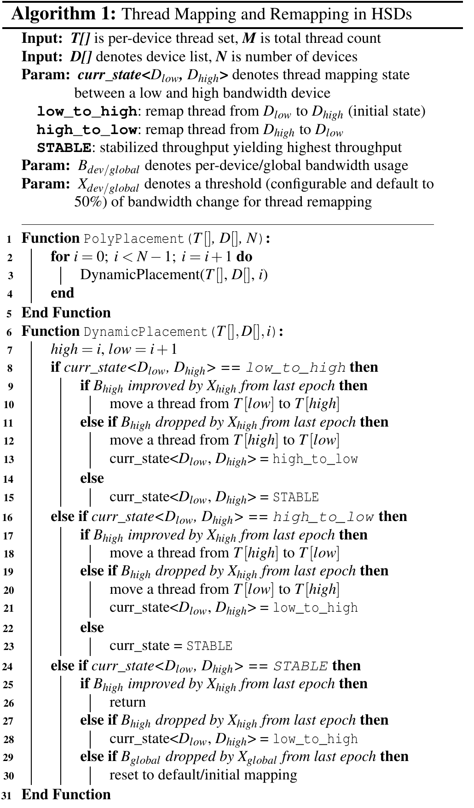
       <figcaption>Algorithm 1: Thread mapping and remapping. States are low_to_high (initial), high_to_low, and STABLE. Note lines 29-30: a global bandwidth drop resets the whole mapping.</figcaption>
   </figure>

- `low_to_high` (initial): keep moving threads onto the faster device while its bandwidth improves; if it *drops*, flip to `high_to_low`.
- `high_to_low`: shed threads to slower storage to relieve contention.
- `STABLE`: stop remapping. Only a **global** bandwidth drop (line 29) forces a reset to the initial mapping.

This is the direct answer to the contention problem in §3 — instead of assuming PM is best, it *measures* whether adding another thread to PM still helps.

## Migration (§4.5.2)

Two 2-bit-state migrations over Poly-index (`MORE_FREQUENT` / `LESS_FREQUENT`, threshold 50% of accesses by default):

- **`BW_Move`** (bandwidth-aware): promote hot blocks from slow to fast storage — **but only if the target's read *and* write bandwidth are not saturated** and it has free space. This is precisely what Orthus and SPFS get wrong.
- **`CAP_Move`** (capacity-aware): when a device crosses a **90% watermark**, a background thread demotes blocks downward.

Mechanism is append → update Poly-index → truncate source + mark garbage, all **wrapped in a transaction**. Garbage is collected by `fallocate` hole punching or by compaction.

## Poly-cache: heterogeneity-aware DRAM caching (§4.6)

User-level, **bypassing the OS page cache** entirely — no double caching, no kernel trap on a hit. Buffers hang off Poly-index nodes (2 MB, backed by huge pages where available). Eviction is a **two-level LRU** (file-level LRU for inactive files, per-file range LRU inside), budgeted per application with **cgroups**, executed by a thread pool that starts at one thread per storage type and **scales up with observed bandwidth** — evictions themselves exploit cumulative bandwidth. Because the layout is horizontal, eviction can also *redirect* a block to a different device than the one it came from, which quietly doubles as a placement optimization.

Two device-specific policies:
- **Bypass the cache for PM reads.** PM reads are already fast; a DRAM copy adds overhead with no gain. Blocks are read directly from a PM mapping until a write touches the range. Writes still get buffered, because PM writes are the slow direction.
- **Dynamic cache ratio for SSDs.** Give the *slower* device (SATA vs NVMe) a larger share of the cache, adjusted from measured bandwidth/latency and the access ratio between devices.

## Poly-persist + PolyOS (§4.7-4.8)

- **Atomicity** for `rename`/`link`/`truncate`: a journal with a global log of uncommitted files, per-file metadata, and an operational log. Commit = serially commit to the device file system, then update Poly-inode/Poly-index. Unrecoverable files are marked inaccessible and left to `fsck`.
- **Crash consistency**: Poly-inode log entries are sized to **one cache line**, Poly-index range nodes to **two**, committed with `clflush` + fences on PM; without PM, memory-mapped files plus `msync`. Recovery waits for the underlying file systems to mount first, then replays.
- **Common minimal durability**: since NOVA gives full data+metadata durability while ext4 ships with data journaling off, PolyStore levels down to a **uniform baseline** (metadata-only in the NOVA+ext4 config) rather than pretending the guarantees are uniform. Honest, and a real limitation.
- **Security**: a user-level cache is a corruption risk — a read-only process could append a bogus cache buffer into the shared Poly-index. PolyOS handles this by **revoking write access to the memory-mapped Poly-index file** when a file is shared, forcing all subsequent index updates through the kernel. Fairness across applications uses Linux I/O throttling.

# Evaluation

**Testbeds (Table 2/3)**

| | Config I | Config II | Config III |
|---|---|---|---|
| Faster | 256 GB Optane PM | 1 TB NVMe SSD | 256 GB Optane PM |
| Slower | 1 TB NVMe SSD | 2 TB SATA SSD | 1 TB NVMe SSD |
| Slowest | - | - | 2 TB SATA SSD |

Device bandwidths (write / read): PM **4.6 / 13.2 GB/s**, NVMe **1.2 / 1.2 GB/s**, SATA **560 / 530 MB/s**. File systems: NOVA for PM, ext4 for NVMe/SATA. Baselines: PM-only (NOVA), NVMe-only, SATA-only, **Orthus** (caching), **Strata** and **SPFS** (tiering), **P2CACHE** (PM+DRAM). *None of the baselines supports more than two device types* — Config III is PolyStore-only.

## 5.1 Cumulative bandwidth (Config I, direct I/O, 4 KB, 64 GB)

<figure>
       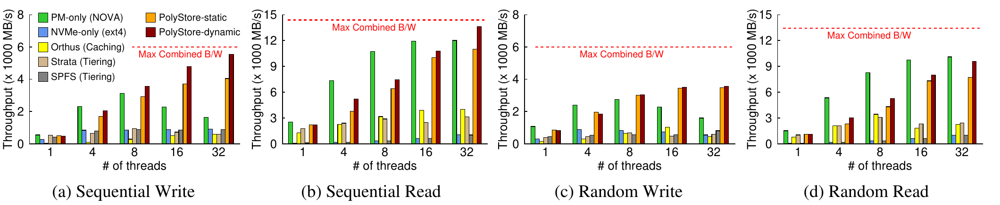
       <figcaption>Figure 3: Microbenchmark with direct I/O (no DRAM cache) on PM/NVMe. Red dotted lines = maximum combined PM+NVMe bandwidth.</figcaption>
   </figure>

- **Sequential write**: PolyStore-static already beats PM-only **2.16x**, NVMe-only **3.25x**, Orthus **4.23x**. PolyStore-dynamic reaches **92.3% of combined bandwidth** at 32 threads — **1.48x** over static and **up to 9.38x** over the other approaches.
- **Random write**: dynamic gains over static are marginal, because static mapping already happens to be near-optimal there.
- **Sequential read**: PolyStore-dynamic beats PM-only by **1.11x** at 32 threads. Modest — but note PM-only *is* the read-bandwidth king here (13.2 GB/s), so exceeding it at all means the NVMe read path is genuinely additive.

**Table 4 — average latency (µs), 32 threads, Config I.** This table is the cleanest single result in the paper.

| System | Sequential Write | Sequential Read |
|---|---|---|
| Orthus | 150.4 | 54.3 |
| Strata | 144.1 | 73.2 |
| SPFS | 123.2 | 121.4 |
| PolyStore-static | 85.2 | 84.1 |
| **PolyStore-dynamic** | **23.5** | **22.9** |

Write latency drops **6.38x** vs Orthus. The hierarchical systems' latency *spikes* at high thread counts precisely because they funnel everything into PM.

<figure>
       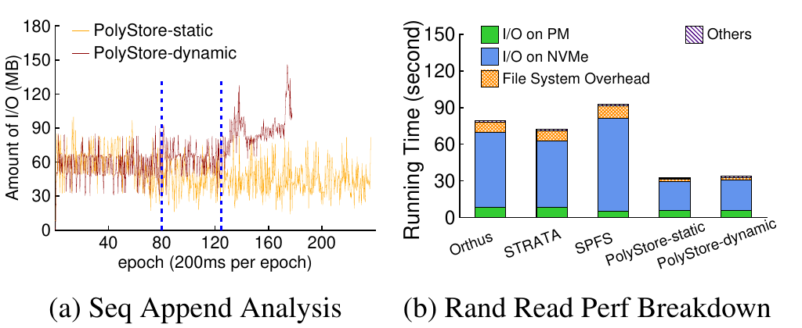
       <figcaption>Figure 4: (a) Per-epoch I/O for sequential write. PolyStore-dynamic converges to 8-10 threads on PM with the rest on NVMe, and re-saturates PM (epochs 80 and 124, dotted lines) as PM threads finish. (b) Random-read breakdown — the extra cost of running two file systems is more than repaid.</figcaption>
   </figure>

## 5.2 Sensitivity

<figure>
       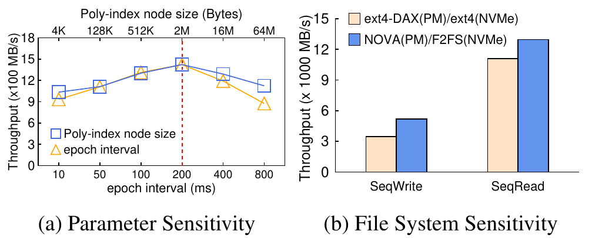
       <figcaption>Figure 5: (a) Poly-index node size and epoch interval, Config II — both peak at the chosen defaults (2 MB / 200 ms). (b) File system choice, Config I.</figcaption>
   </figure>

- Node size: smaller is better for bandwidth, worse for memory footprint. Epoch interval: shorter reacts faster, costs more profiling. 2 MB and 200 ms are the measured knees, not arbitrary picks.
- **File systems matter a lot**: NOVA(PM)/F2FS(NVMe) beats ext4-DAX(PM)/ext4(NVMe) by **up to 1.63x**. This validates the whole "reuse mature per-device file systems" premise — the meta-layer inherits their quality.

<figure>
       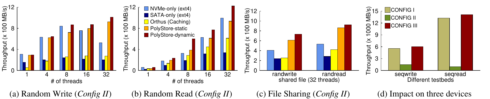
       <figcaption>Figure 6: Config II (NVMe/SATA) and Config III (three devices).</figcaption>
   </figure>

- **No PM required**: on NVMe+SATA, PolyStore gets **1.87x** over NVMe-only on writes and **2.23x** over Orthus on reads. The design is not an Optane artifact.
- **Shared file**, 32 threads (16 readers + 16 writers) on one 64 GB file: **2.95x** for writers, **3.04x** for readers vs NVMe-only — Poly-index's range-level locks dissolve the per-inode `rw-lock` bottleneck by splitting one logical file into several physical files.
- **Three devices**: **91.7%** of the combined bandwidth. Horizontal scaling actually scales.

## 5.3 DRAM caching

<figure>
       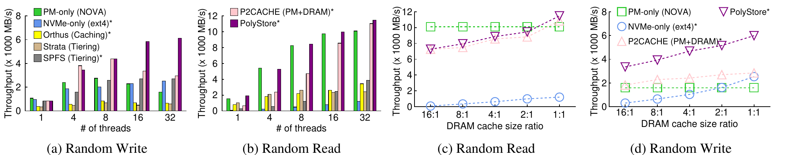
       <figcaption>Figure 7: (a,b) Random write/read with the working set fitting in DRAM. (c,d) Sensitivity to DRAM cache size ratio (16:1 means the workload is 16x the cache).</figcaption>
   </figure>

- Working set in cache: **up to 6.31x** over baselines. P2CACHE collapses at high thread counts because it uses **PM as the write cache**, re-creating the PM contention problem one layer up.
- Cache under pressure (16:1): PolyStore's **concurrent evictions across HSDs** relieve memory pressure, giving **3.18x** over PM-only and **2.21x** over NVMe-only with the OS page cache. The insight is that eviction bandwidth is itself a cumulative resource.

## 5.4 Metadata-heavy (Filebench)

<figure>
       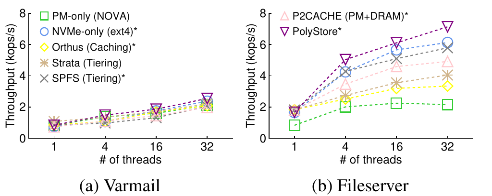
       <figcaption>Figure 8: Varmail and Fileserver. Metadata operations are 69% / 63% of I/O; files are 512 KB / 1 MB with read:write of 1:1 / 1:2.</figcaption>
   </figure>

**3.12x** over PM-only on write-heavy Fileserver. This is the case where PolyStore *could* have lost — small files, lots of creates — and the adaptive on-demand file creation (§4.4.1) is what saves it, since small files never get a second physical file. Gains over the other systems are marginal and come mostly from Poly-cache eliminating syscalls, not from cumulative bandwidth.

## 5.5 Applications

<figure>
       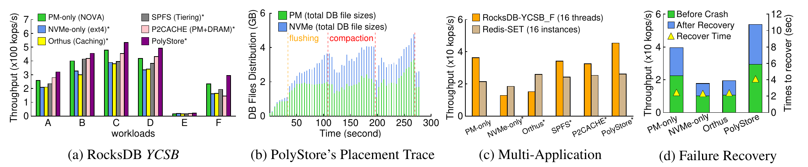
       <figcaption>Figure 9: RocksDB and Redis on PM/NVMe. (a) YCSB A-F, 32 threads, 10M keys, 512 B values, 128 MB SST files. (b) DB file placement trace over time for YCSB-A. (c) RocksDB + 16-instance Redis concurrently. (d) Throughput after failure recovery, with recovery time on the right axis.</figcaption>
   </figure>

- **YCSB**: **1.52x** on write-heavy A, **2.02x** on F. F is the best case because its 50% read-modify-write pattern lets Poly-cache **evict NVMe-resident blocks into PM**, so reaccess is faster — eviction doing placement work, as designed.
- **Multi-application**: **1.96x** over P2CACHE while *not* degrading Redis, using PolyOS's Linux fair-I/O throttling.
- **Failure recovery** (`db_bench fillrandom`, injected failures): recovery is *slightly slower* (physical files must recover before Poly-inodes/Poly-trees), but total throughput is **2.91x** better. Honest reporting of a real tradeoff.

<figure>
       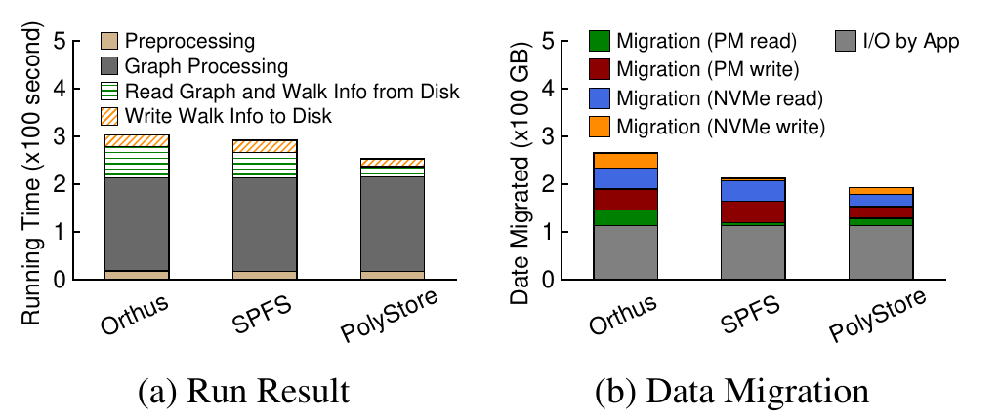
       <figcaption>Figure 10: GraphWalker MS-PPR, 64 GB graph, DRAM capped at 16 GB and PM at 32 GB to force migration. (a) Runtime breakdown. (b) Migration footprint.</figcaption>
   </figure>

- **GraphWalker** is the migration stress test. PolyStore issues **2.46x fewer PM writes** than Orthus, and loads graph + walk info **1.84x / 1.62x** faster than Orthus / SPFS. Mechanism: it checks whether PM's **write** bandwidth is saturated before promoting, and just reads directly from NVMe when it is. Orthus promotes regardless (turning reads into PM writes); SPFS cannot promote at all without a write.

# Takeaways / My Notes

1. **The thesis is about *direction of prioritization*, not about a new device.** Every baseline fails the same way: it decides *a priori* that the fast device should be preferred. PolyStore's contribution is replacing that prior with a **closed-loop measurement** (Algorithm 1's state machine + `BW_Move`'s saturation check). If I remember one number: **92.3% of combined bandwidth** where the best prior system gets a fraction of one device's.

2. **"Meta-layer over mature file systems" is the reusability argument, and the 1.63x NOVA/F2FS-vs-ext4 result is what backs it.** Contrast with Strata, which had to *write* a cross-media file system. PolyStore inherits NOVA's per-CPU scalability and F2FS's flash-friendly logging for free. This is a genuinely good systems-engineering position and it generalizes better than the performance numbers alone suggest — plug in a CXL-SSD and its file system and the layer should still work.

3. **The 2 MB constant is load-bearing and worth remembering.** It is simultaneously: the Poly-index locking granularity, the Poly-cache buffer size, the huge-page size, the small-vs-large file threshold, and Linux's max single block I/O request size. That last alignment is the non-obvious one — it means a whole range evicts in one request.

4. **Eviction as placement is the sleeper idea.** Because the layout is horizontal, Poly-cache can evict a block to *any* device, not back to where it came from. That is what produces the best YCSB-F result, and it is a capability that no hierarchical cache can have by construction.

5. **Compare with the tiered-memory line of work.** [[TPP-ASPLOS]] and [[Memstrata-OSDI24]] both accept a fast/slow *memory* hierarchy and work hard to place pages well within it; PolyStore argues the hierarchy itself is the bug for *storage*. [[Beluga-SIGMOD26]] takes the third position — close the latency gap in hardware until placement stops mattering. Three different answers to the same question, and the deciding variable is how big the fast/slow gap actually is: PolyStore's PM/NVMe gap (~4x write) is small enough to make horizontal striping win, which would not hold for DRAM vs. a SATA SSD.

6. **Where I am skeptical.** (a) The headline **9.38x** is a microbenchmark best case; real applications land at **1.52x-2.02x**, and Filebench gains over non-PM-only baselines are marginal. (b) The **common minimal durability** rule means adding one weak file system silently downgrades guarantees for the whole logical file — the paper is upfront about it, but it is a sharp edge for anyone deploying this. (c) The static thread mapping is bootstrapped from **offline `fio` profiling**, which is a deployment burden the paper does not really price. (d) The greedy state machine is per *adjacent device pair* and hill-climbing; with three devices it converges well here, but nothing argues it generalizes to many devices or to adversarial workload phase changes — the only escape hatch is the global reset on line 29. (e) Optane is discontinued, so Config II (NVMe/SATA) is really the result that matters for the future, and it is the weaker one (1.87x).

7. **Open direction**: the obvious follow-on is CXL-attached SSDs / CXL memory as another "device" in the horizontal set — cited in the intro but never evaluated. That is exactly the seam where this line meets [[Beluga-SIGMOD26]].

## Acknowledgement
All figures are cropped from the authors' paper (FAST '25 proceedings, pp. 539-555).

## Links
- Paper: [USENIX FAST '25](https://www.usenix.org/conference/fast25/presentation/ren), [PDF](https://www.usenix.org/system/files/fast25-ren.pdf)
- Code: [RutgersCSSystems/PolyStore](https://github.com/RutgersCSSystems/PolyStore) (artifact evaluated: available / functional / reproduced; Linux 5.1.0 + NOVA, Ubuntu 20.04.5)
- Local PDF: `/Users/garson/Research/NCSU/Paper/PolyStore_FAST25.pdf`
