# Beluga: A CXL-Based Memory Architecture for Scalable and Efficient LLM KVCache Management

SIGMOD '26, Alibaba Cloud Computing (arXiv:2511.20172v2, 27 Nov 2025)

**In one sentence**: Beluga puts the LLM KVCache in a shared memory pool behind a *real commercial CXL 2.0 switch* (XConn XC50256), so that both CPUs and **GPUs** reach it with plain `load/store` instead of RDMA. Result: **89.6% lower TTFT and 7.35x higher QPS** than MoonCake in the cache-hit case.

# Background

1. LLM inference has two phases: the compute-intensive **prefill** (processes the prompt in parallel, produces the first token) and the autoregressive **decode** (each new token depends on all preceding KV activations). The **KVCache** stores those KV activations — a space-for-time trade that avoids recomputation and lets you share prefixes across requests (multi-turn dialogue, fixed system prompts, RAG documents).

2. The KVCache is huge. 50M tokens in Kimi needs about **20 TB of DRAM** to reach a good hit ratio. HBM is fast but small, and host DRAM is capped by the number of memory channels per socket. So the KVCache has to be **offloaded to a disaggregated pool**.

3. A KVCache pool must satisfy four requirements:
   - **Scalable capacity** — footprint grows linearly with context length, GBs per request.
   - **Efficient sharing** — all servers in a multi-GPU cluster must see one pool.
   - **Low-latency access** — retrieval must be *cheaper than recomputation*, or caching is pointless.
   - **High aggregate throughput** — a multi-GPU server is parallel; too little bandwidth stalls GPUs.

4. Today everyone builds this pool on **RDMA** (MoonCake, Dynamo, LMCache). Figure 1 contrasts that with what Beluga does: replace the NICs + network switch with CXL cards + a CXL switch.

<figure>
       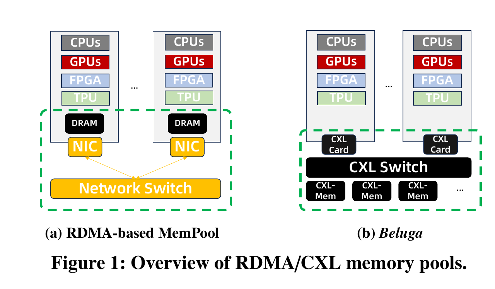
       <figcaption>Figure 1: Overview of RDMA-based vs. CXL-based (Beluga) memory pools.</figcaption>
   </figure>

5. **CXL recap.** Three protocols: **CXL.io** (discovery/DMA), **CXL.cache** (coherent device access to host memory), **CXL.mem** (host `load/store` to device-attached memory). Evolution: 1.1 = single-device attach, **2.0 = switch-based pooling**, 3.0 = multi-tier switching with cache coherency. Prior CXL work was stuck on CXL 1.1 or FPGA prototypes. The **XConn XC50256** is the first commercial CXL 2.0 switch: **256 lanes, ~750 ns** minimum 64B I/O latency, **2 TB/s** switching capacity. *This switch is what makes the paper possible.*

# Motivation: why RDMA is the wrong tool

RDMA was designed as a **networking protocol, not a memory bus**. Two access models exist, both flawed:

- **CPU-driven** (vLLM, MoonCake, LMCache): the host CPU posts RDMA commands. Writing means GPU -> **bounce buffer in host DRAM** -> remote pool. Reading is the reverse.
- **GPU-driven** (GPUDirect RDMA): the GPU issues commands straight to the NIC, but a dedicated **polling kernel occupies SMs**, and GDR only exists on datacenter GPUs (A100/H100), not on consumer cards like the RTX 4090.

## Performance problems

1. **Indirect host-staged data path.** The mandatory bounce buffer adds latency to every single transfer.

2. **Complex and inefficient control path.** *This is the paper's most important number.* On an H20 GPU, a 16 KB transfer takes **10.55 us total, of which only 2.68 us is actual data movement**. The remaining ~8 us (nearly 75%) is synchronization — launching the kernel or waiting for completion. The synchronization penalty alone is **~3x the duration of the data transfer itself**.

3. **Scatter-gather mismatch.** KV tensors are non-contiguous. One Qwen3-32B (GQA) KVCache block of 16 tokens needs **128 non-contiguous 20 KB transfers**, but a ConnectX-7 NIC limits sglists to **30 entries** — so software must split it into multiple RDMA requests.

4. **Wasted resources.** Polling burns entire CPU cores (CPU-driven) or SMs, the GPU's most limited resource (GPU-driven).

## System complexity problems

1. **Non-trivial development complexity.** Developers manage the RDMA stack *inside CUDA* and orchestrate polling/computation stream synchronization, instead of writing simple memory operations.

2. **Optimization complexity for tiered memory.** The local/remote latency gap forces **cache-aware scheduling** — routing requests to whichever node already holds the blocks. That couples placement to routing, and produces skewed KVCache distribution, load imbalance, and high maintenance overhead.

# Beluga: architecture

Figure 2 is the key architectural diagram. In (a) the RDMA baseline, each 8-GPU server has 4 dedicated RDMA NICs going out to a RoCE/IB network. In (b) Beluga, those four NICs are replaced by **two PCIe/CXL adapters** connecting to a CXL switch box, which in turn fronts a separate memory box.

<figure>
       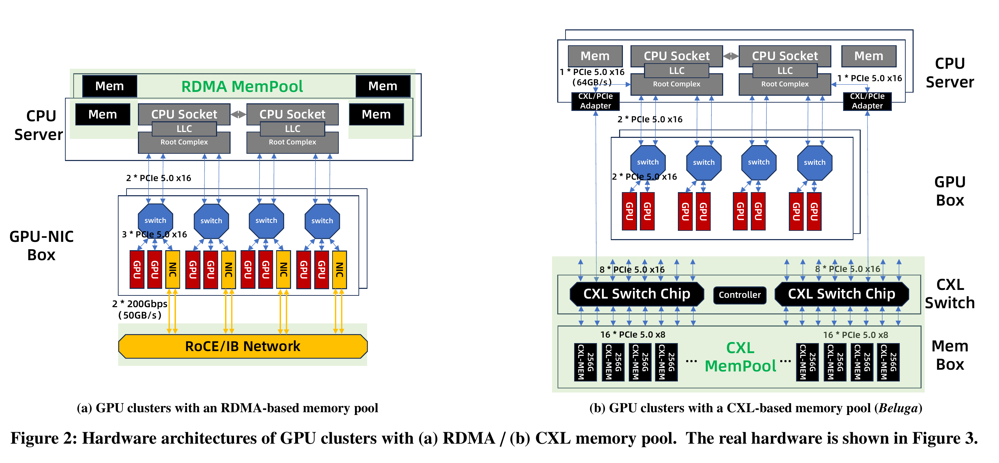
       <figcaption>Figure 2: Hardware architectures of GPU clusters with (a) RDMA and (b) CXL (Beluga) memory pools.</figcaption>
   </figure>

Configuration numbers to remember:
- Each server has **two CPU sockets** (NUMA); each socket connects to the switch via one **PCIe 5.0 x16** PCIe/CXL adapter.
- The switch box holds **two XConn XC50256 chips**, each forwarding **2 TB/s** over 256 PCIe 5.0 lanes, split between memory devices and compute servers.
- The pool scales to **16 servers on 8 TB with 1 TB/s** total bandwidth.

<figure>
       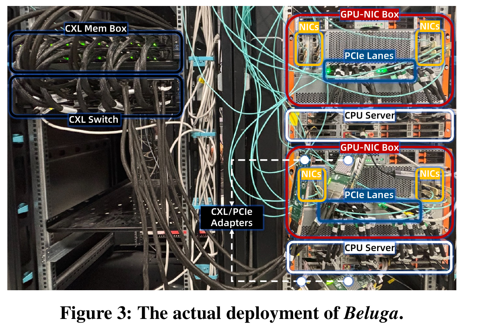
       <figcaption>Figure 3: The actual deployment of Beluga (real hardware, not a simulation).</figcaption>
   </figure>

## Data access interfaces

Figure 4 shows the four ways data moves. For the **CPU**: (1) direct `load/store`, (2) hardware-accelerated DMA via **Intel DSA** (available on Sapphire Rapids). For the **GPU**: (1) peer-to-peer `cudaMemcpy`, (2) fine-grained non-contiguous access through **custom CUDA kernels**.

<figure>
       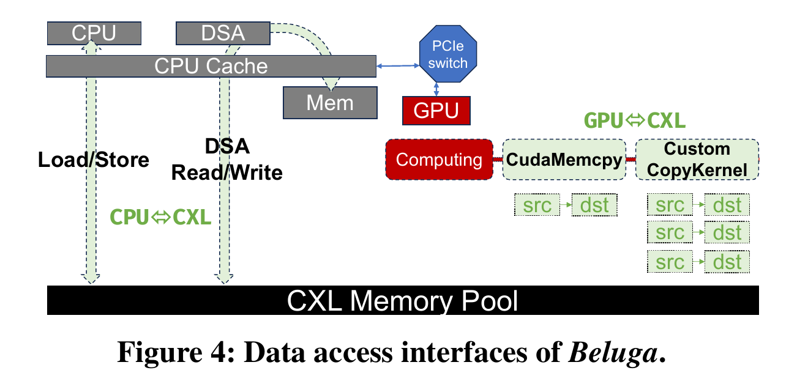
       <figcaption>Figure 4: Data access interfaces of Beluga (CPU load/store + DSA; GPU cudaMemcpy + custom copy kernel).</figcaption>
   </figure>

## Inherent advantages

1. **Data path**: the GPU reaches the pool directly — no bounce buffer, no multi-step staging.
2. **Control path**: transfer kernels live in the GPU's **native CUDA stream**, so cross-component synchronization disappears entirely (no external CPU coordination, no internal GPU polling).
3. **Programming model**: interfaces look like local DRAM. No network stack, no work-request preparation.
4. **Memory management**: at startup the **BIOS** on each host detects attached CXL devices and reserves a contiguous physical address space. Each host manages the pool in **Direct Access (DAX) mode**, exposing it as a block device so user-space processes can `mmap()` it. Hosts either take different offsets (partitioning) or map the same region (sharing).
5. **Hardware cost** (Table 1): a PCIe/CXL adapter is **$210 vs $1,745** for a CX-7 NIC; an XConn CXL switch is **$5,800 vs $16,000** for a Mellanox RoCE switch. Per 64 GB/s: **$218.75 vs $800**.

# Characterization and Optimization (Section 5)

**Testbed**: Ubuntu 22.04 / kernel 6.2.0, 2x Xeon Platinum 8575C, 2 TB DDR5 local DRAM, **8x H20 (96 GB)** per server. RDMA baseline uses 4x ConnectX-7 (200 Gbps). Beluga uses 2x PCIe/CXL adapters and an **8 TB CXL pool**.

## 5.1 Data sharing over non-coherent CXL

**The core problem**: CXL 2.0 switches **do not support host-to-host hardware cache coherence**. Each node keeps an independent L1/L2/L3 hierarchy, so a write by one host stays in its local cache and never propagates. Coherence must be enforced *in software*.

Beluga only needs to handle the **single-writer / multiple-reader** pattern (one host inserts a KVCache block, many read it), which is what makes this tractable.

**Writer side — make data actually reach CXL memory.** Three options:
1. *Static uncacheable (UC) configuration* via **MTRRs**; also disable **DDIO** so GPU-to-host `cudaMemcpy` traffic bypasses the LLC and goes straight to CXL.
2. *Fine-grained cache flushing* with `CLFLUSH`/`CLFLUSHOPT`/`CLWB` — overhead scales linearly with data size.
3. *Bypassing-cache writes without flushing* — non-temporal stores (`ntstore`); Intel DSA has an equivalent cache-bypass flag.

**Reader side — avoid stale data.** Two options:
1. *Static UC configuration*. Needed even for device-initiated `cudaMemcpy`: the GPU op does not populate the CPU cache, but *prior CPU activity* may have left cached copies, so without UC the GPU can read stale data.
2. *Fine-grained flush before read* with `CLFLUSH` (note: **`CLWB` does not work** here, since it writes back without invalidating).

**Table 4 — latency of coherency methods (16 KB, us).** Bold = best per column.

| Write direction | CPU store | CPU DSA write | GPU custom kernel |
|---|---|---|---|
| UC Mem / disable DDIO | 281.56 | **1.69** | **9.14** |
| CLFLUSH after write | 8.50 | 3.64 | 11.06 |
| Bypassing-cache write | **2.41** | 1.76 | - |

| Read direction | CPU load | CPU DSA read | GPU custom kernel |
|---|---|---|---|
| UC Mem | 166.49 | **2.12** | **10.55** |
| CLFLUSH before read | **5.98** | 4.84 | 16.81 |

**The counterintuitive takeaway**: uncacheable memory is *catastrophic* for CPU `load`/`store` (166-281 us) because every access stalls the CPU pipeline waiting for the whole CXL round trip — but it is *optimal* for DSA and for GPU transfers, which are not subject to CPU pipeline stalls. **Cacheability must be chosen per-initiator, not per-region.**

## 5.2 Latency optimization

<figure>
       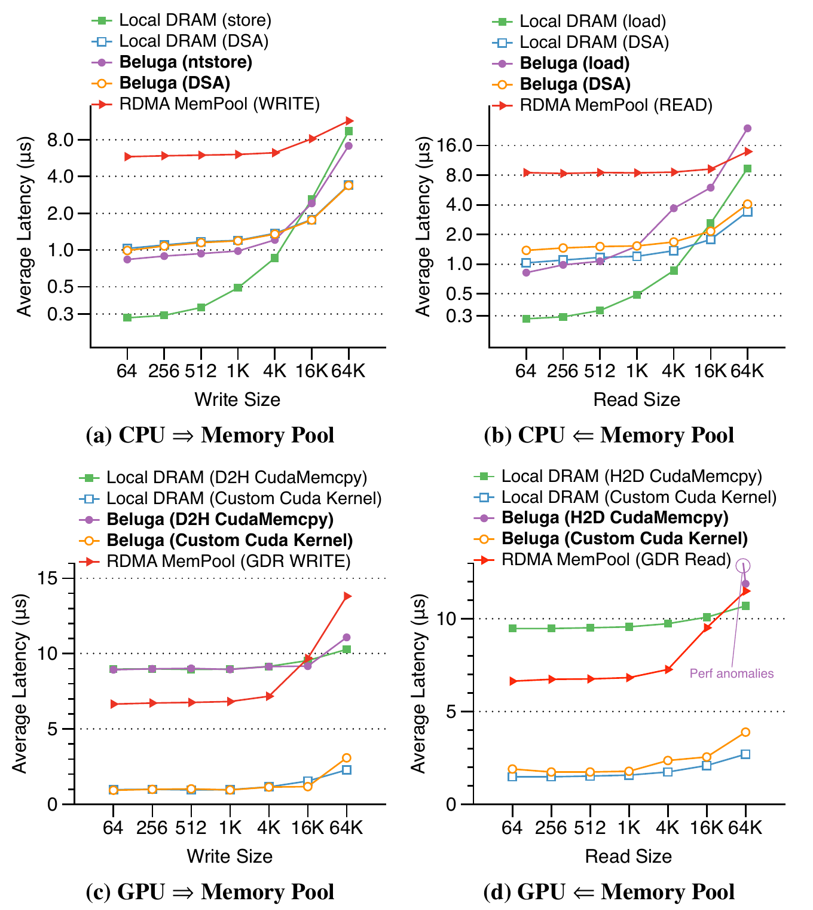
       <figcaption>Figure 5: Latency between CPU/GPU and the remote memory pool (Exp #2). Local DRAM and the RDMA pool are baselines. Note the flat red RDMA curves sitting well above the CXL curves.</figcaption>
   </figure>

1. **GPU access to CXL is competitive with local paths.** A 64 KB CXL-to-GPU copy takes **11.73 us vs 10.32 us** for a conventional CPU-to-GPU copy. CXL memory is a viable *primary* data source for GPU workloads.
2. **Crossover at 4 KB**: CPU `load/store` wins below 4 KB; **DSA wins above 4 KB**, where DMA parallelism outgrows its setup cost.
3. **CUDA Memcpy Kernel latency is dominated by software overhead** — the 10.55 us / 2.68 us split from Section 3, confirmed with Nsight.
4. **Trap**: standard `cudaMemcpy` for H2D **degrades catastrophically below 24 KB on uncacheable memory** (~**1.23 ms**), because the CUDA runtime uses CPU-based instructions to optimize small transfers — exactly the wrong strategy for UC memory.

## 5.3 Bandwidth optimization

Two anomalies on a single x16 PCIe/CXL adapter:
- **Asymmetric read/write**: CPU read from the pool hits the expected 46.2 GB/s, but write is capped at **33 GB/s**.
- **GPU access degrades to 26 GB/s**, well below both the CXL controllers' and the GPU's own PCIe bandwidth (55.4 GB/s).

<figure>
       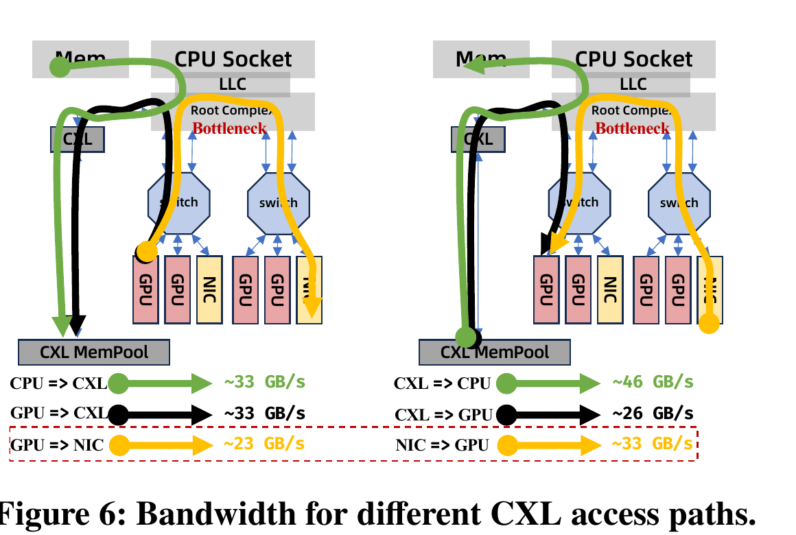
       <figcaption>Figure 6: Bandwidth for different CXL access paths. The bottleneck is labeled on the CPU Root Complex, not on the CXL devices or switch.</figcaption>
   </figure>

**Bottleneck = the CPU's Root Complex (RC)**, not CXL. Verified by a micro-benchmark between a GPU and a NIC on *different* PCIe switches, forcing traffic through the RC: it reproduces the numbers exactly (P2P write 33 GB/s, P2P read 23 GB/s). Adding a second GPU-NIC pair roughly doubles throughput to 46 GB/s, so the limit is **per-lane/per-link resources inside the RC**, not a global throughput cap.

Also: each CXL memory device supports only **22.5 GB/s**, so directing all traffic at one device is device-bottlenecked. Beluga's current fix is **software memory interleaving at 2 MB granularity** (Intel Granite Rapids will add hardware interleaving, 256 B chunks up to 8-way).

## Table 3 — the nine optimizations (worth remembering as a checklist)

| Aspect | Optimization | Applies to |
|---|---|---|
| Coherency | **O1.** Use `ntstore` for CPU writes; invalidate CPU cache before reads | CPU `load/store` |
| | **O2.** Set memory Uncacheable for CPU DSA | CPU DSA |
| | **O3.** Set memory Uncacheable and **disable DDIO** | GPU |
| Latency | **O4.** Direct `load/store` for small I/O (< 4 KB), DSA for larger | CPU |
| | **O5.** Launch kernels asynchronously on CUDA streams to hide launch latency | GPU |
| | **O6.** For GPU transfers < 24 KB on UC memory, use a custom copy kernel | GPU |
| Bandwidth | **O7.** Connect GPUs directly to the CXL switch in future architectures | GPU |
| | **O8.** Scale the number of PCIe/CXL adapters with the workload | - |
| | **O9.** Interleave data across multiple CXL memory devices | - |

## 5.4 Complex workloads

- **Skewed access (Exp #3, zipf 0.99, 64 GB, 16 threads)**: CXL median latency is only **10.2%-13.3% of RDMA's** at 64 B, and **39.5%-56.2% of local DRAM** for 16 KB writes. Without interleaving, the first memory device becomes a queuing bottleneck.
- **Background pressure (Exp #4)**: median latency stays flat as background bandwidth grows 0 -> 15 GB/s; **p99 rises only when background traffic runs in the same direction**.

# Beluga-KVCache (Section 6)

<figure>
       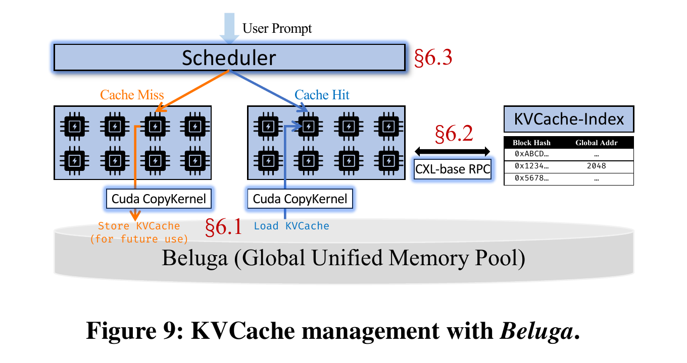
       <figcaption>Figure 9: KVCache management with Beluga. Sec 6.1 = CUDA CopyKernel data transfer, Sec 6.2 = CXL-based RPC for the KVCache index, Sec 6.3 = the simplified scheduler.</figcaption>
   </figure>

## 6.1 Data transfer for KVCache

The KVCache layout is **badly fragmented**: K and V tensors sit non-contiguously across attention layers, and within a layer the KV tensors of different tokens are also non-contiguous. Two access patterns follow:
- **Gather write** (KVCache write): many non-contiguous GPU locations -> one contiguous remote block.
- **Scatter read** (KVCache read): one contiguous remote block -> many non-contiguous GPU locations.

<figure>
       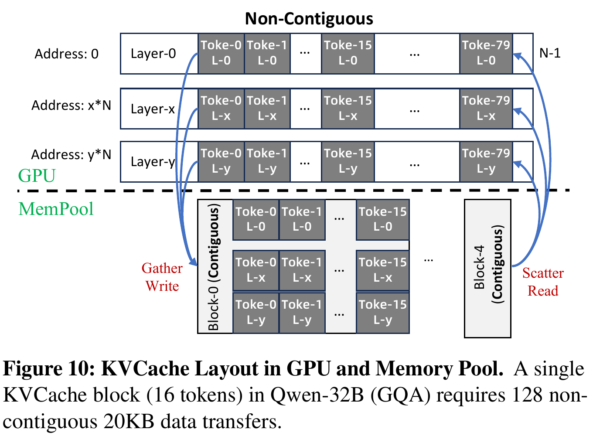
       <figcaption>Figure 10: KVCache layout in GPU and memory pool. A single 16-token block in Qwen3-32B (GQA) requires 128 non-contiguous 20 KB transfers.</figcaption>
   </figure>

**Sparse KVCache makes it far worse.** Exploiting sparsity for a *single token* yields `n_chunks = n_layers x n_heads x 2 = 64 x 8 x 2 = 1024` chunks of only **160 bytes** each. Thousands of tiny requests -> IOPS bottleneck. RDMA is helpless here.

Beluga instead uses a **fine-grained custom CUDA copy kernel** with unlimited gather/scatter width — solving the problem structurally rather than by batching.

## 6.2 CXL-based RPC

Instead of RDMA/TCP for KVCache index lookups, Beluga does RPC **over shared memory**. Clients and the metadata server pre-allocate fixed-size slots in CXL memory. A client writes a request into an idle slot and sets `REQ_READY`; the server spin-waits on status flags, processes it, writes to a reply slot and sets `RESP_READY`.

Four optimizations: `ntstore` on the client (no cache pollution), `CLFLUSH` before server reads (visibility), batched `mfence` plus cache-line alignment, and everything in **user space** (no kernel transitions or context switches).

<figure>
       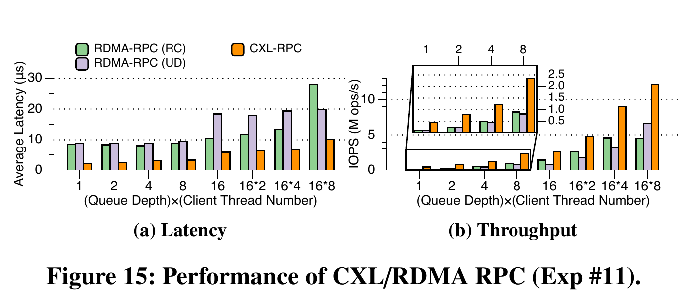
       <figcaption>Figure 15: Performance of CXL vs RDMA RPC (Exp #11).</figcaption>
   </figure>

- **QD=1**: CXL-RPC round trip is **2.11 us**, a **4x improvement** over RDMA-RC (8.39 us) and RDMA-UD (8.83 us) — and this includes four memory operations (two reads + two writes).
- **QD=128**: single-thread throughput reaches **12.13 Mops**, beating RDMA-RC (4.5 Mops) by **2.7x** and RDMA-UD (6.65 Mops) by **1.8x**.
- **Caveat the authors state explicitly**: CXL-RPC has **weaker reliability guarantees** than RDMA transport; reliability is pushed to upper layers. It targets rack-scale deployments, *not* a full RDMA replacement.

## 6.3 Scheduling without KVCache hierarchy

**This is the most important systems consequence and the paper under-sells it.** Because remote CXL latency is comparable to local buffer latency (proved in 5.2), the local/remote performance gap that forces Dynamo and MoonCake into **cache-aware scheduling** simply disappears. The pool becomes a **unified, symmetric address space**, which enables:
- **cache-oblivious scheduling** — standard load balancing, no locality routing;
- inference nodes can be **added/removed without rebalancing** KVCache partitions.

The design decouples compute scheduling from KVCache locality entirely.

# Evaluation (Section 7)

**Setup**: 2 servers x 8 H20 (96 GB) = **16 concurrent vLLM instances** (v0.8.5, V1 engine, prefix caching on, HBM for KVCache), unquantized **Qwen3-32B**, workload **LV-Eval** (long-context QA, 15K-token sequences). Pool capped at 2 TB for both systems. Baselines: **MoonCake v3.2** (RDMA, on vLLM + LMCache v0.3.1) and **Dynamo v0.4.1**.

Two scenarios: **cache-populate** (first run, vLLM computes and stores) and **cache-hit** (second run, KVCache pre-populated, prefill accelerated by reuse).

## Table 5 — end-to-end inference performance on LV-Eval (Exp #5)

| Metric | Dynamo | vLLM | vLLM+MoonCake | **vLLM+Beluga** |
|---|---|---|---|---|
| **First run (cache-populate)** | | | | |
| Avg TTFT | 17.96 s | 18.76 s | 19.66 s | **17.22 s** |
| P99 TTFT | 54.53 s | 40.47 s | 41.65 s | 44.6 s |
| Avg TPOT | 1.55 s | 2.580 s | 1.97 s | **1.54 s** |
| P99 TPOT | 10.99 s | 20.17 s | 20.84 s | 16.14 s |
| QPS | 1.15 | 0.96 | 1.02 | **1.24** |
| **Second run (cache-hit)** | | | | |
| Avg TTFT | 15.69 s | 18.23 s | 13.00 s | **1.36 s** |
| P99 TTFT | 40.97 s | 39.25 s | 39.91 s | **5.02 s** |
| Avg TPOT | 1.38 s | 2.82 s | 1.10 s | **0.15 s** |
| P99 TPOT | 11.01 s | 19.74 s | 10.58 s | **1.34 s** |
| QPS | 1.32 | 0.96 | 1.54 | **11.32** |

- Cache-populate (30% hit ratio): Beluga cuts avg TTFT **12.4%** vs MoonCake and raises QPS **21.5%**.
- Cache-hit: **89.6% lower avg TTFT, 7.35x QPS**. This is the headline result.
- Why MoonCake loses: (1) the intrinsic CXL-vs-RDMA gap, and (2) extra memory copies and allocations on its critical path.
- Context: the model itself takes 60.0 GB of the 92% allocated memory, leaving only 28.3 GB for KVCache in HBM, so the **GPU HBM hit ratio peaks at just 14.6%** — which is precisely why pool performance dominates.

## Sensitivity analysis

<figure>
       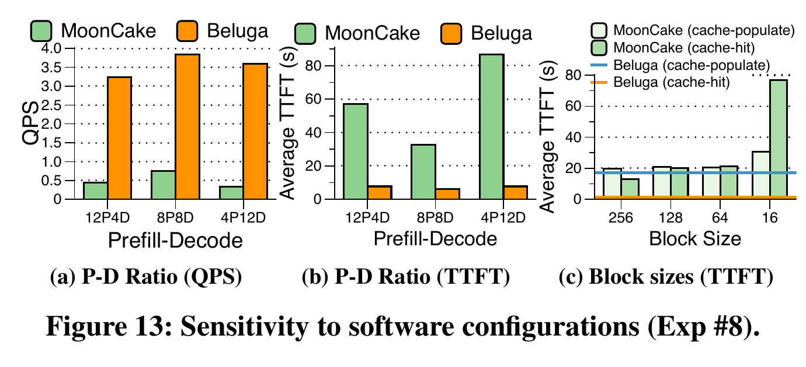
       <figcaption>Figure 13: Sensitivity to software configurations (Exp #8) — prefill-decode ratios and KVCache block sizes.</figcaption>
   </figure>

- **Request arrival rate (Exp #6)**: Beluga wins consistently on the cache-hit run, because when everything hits, **KVCache read becomes the primary bottleneck**.
- **Context length (Exp #7)**: the advantage *grows* with input length (2K -> 4K -> 8K -> full LV-Eval), since KVCache I/O is a larger share of end-to-end latency in long-context scenarios.
- **Prefill-decode disaggregated (Exp #8)**: Beluga delivers **3.41x-9.47x higher QPS** than MoonCake.
- **Block size (Exp #8, Fig 13c) — a great practical finding.** RDMA needs batching to amortize control overhead, so LMCache defaults to **256-token blocks**. MoonCake gets 13.0 s TTFT at 256 tokens but **76.8 s at vLLM's native 16-token block** — *worse than recomputing from scratch*. Beluga runs efficiently at the native 16-token granularity, with no batching required.
- **Interleaving (Exp #8)**: software interleaving across 2 adapters / 32 devices gives QPS 11.32 vs 8.49 without -> **33.2% improvement**.

## Transfer micro-benchmarks

<figure>
       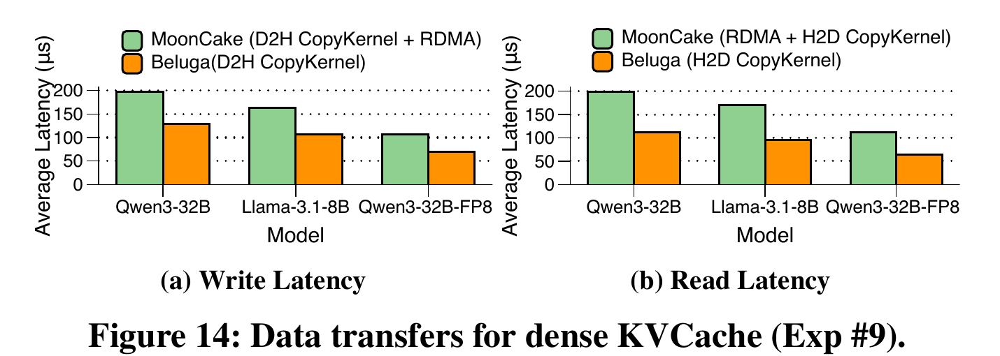
       <figcaption>Figure 14: Data transfers for dense KVCache (Exp #9), across Qwen3-32B, Llama-3.1-8B, and Qwen3-32B-FP8.</figcaption>
   </figure>

- **Dense KVCache (Exp #9)**: eliminating the host bounce buffer reduces write latency **36.2%** and read latency **38.7%**. (Qwen-32B spreads a block over 128 non-contiguous sub-blocks; Llama-3.1-8B over 64.)
- **Sparse KVCache (Exp #10)**: for top-256-token selection over a 7942-token sequence, **over 74% of the selected high-importance tokens in Qwen3-32B are non-contiguous** — sparse access is overwhelmingly discrete. Loading 16 sparse tokens: **RDMA 5260 us vs CXL 211 us** (Qwen3-32B) and 2670 us vs 97 us (Llama-3-8B) — a **95.9% latency reduction**.

# Future Work (Section 8)

<figure>
       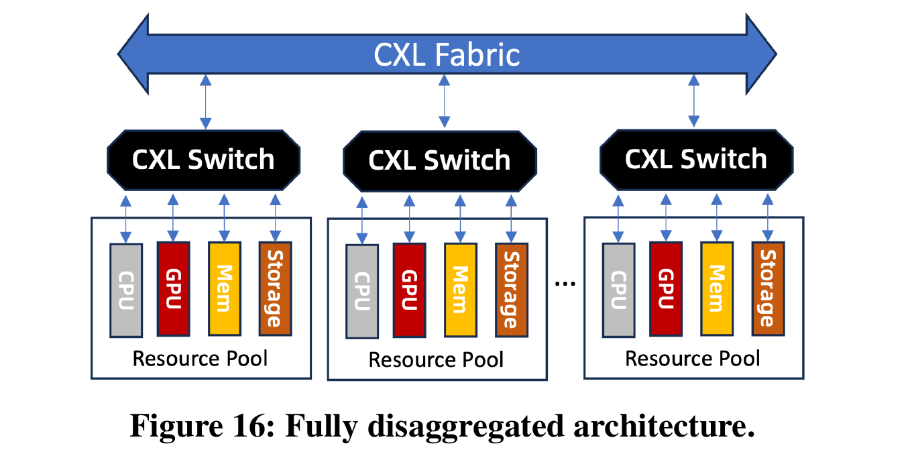
       <figcaption>Figure 16: The fully disaggregated architecture the authors envision on CXL 3.1 — GPUs attached directly to the fabric, bypassing the host Root Complex.</figcaption>
   </figure>

- **Hardware**: **CXL 3.1** enables a symmetric fabric connecting compute/memory/storage pools, with GPUs attached **directly** so traffic never traverses the host PCIe switch and Root Complex — the exact bottleneck identified in 5.3.
- **Software**: schedulers managing GPU/CPU across multiple CXL switches; better coherence protocols via (1) application-level semantics to relax coherency, (2) **directory-based coherence using in-switch resources**, (3) hybrid models where a small hardware-coherent region holds coherence metadata for a much larger address space.
- **Database**: CXL pooling for memory-intensive DB workloads — vector and graph databases; e.g. HNSW breaking free of single-node memory limits.

# Takeaways / My Notes

1. **The argument is about interface, not bandwidth.** RDMA and CXL have comparable raw bandwidth on this testbed. CXL wins because `load/store` removes the bounce buffer *and* the control-path synchronization. If I remember one number: **10.55 us total, 2.68 us of it real data movement**.

2. **The scheduling result is the deepest contribution** (Sec 6.3). Closing the local/remote latency gap lets you throw away cache-aware scheduling entirely. Contrast with [[Memstrata-OSDI24]], which works hard to *manage* the tiering gap; Beluga *closes* it instead.

3. **Non-coherence is the real engineering tax.** CXL 2.0 has no cross-host coherence, so Sec 5.1 is essentially "how to hand-roll coherence with `ntstore` and `CLFLUSH`". Only the single-writer/multi-reader KVCache pattern makes this tractable — a general shared-memory workload would be much harder.

4. **Remember the UC-memory inversion**: uncacheable is terrible for CPU load/store (166-281 us) but optimal for DSA and GPU transfers.

5. **Block size connects to [[vLLM-SOSP]]**: RDMA's control overhead forces 256-token blocks, distorting vLLM's native 16-token paging so badly that TTFT (76.8 s) exceeds recomputation. Beluga matching the native block size means the memory system stops dictating the design of the layer above it.

6. **Open questions / limits**: CXL-RPC trades away reliability guarantees; only single-rack scale demonstrated (16 servers, 8 TB); the Root Complex caps bandwidth until GPUs attach directly to the fabric; and the whole thing rests on one specific switch (XConn XC50256) plus Intel DSA, so portability is unproven. Also worth noting the paper's own abstract claims 4.79x throughput while Table 5 reports 7.35x — different scenarios, easy to misquote.

## Acknowledgement
All figures are cropped from the author's paper (arXiv:2511.20172v2).

## Links
- Paper: [arXiv:2511.20172](https://arxiv.org/abs/2511.20172), SIGMOD '26, Bengaluru, India
- Local PDF: `/Users/garson/Research/NCSU/Paper/CXL/Beluga-SIGMOD26.pdf`
